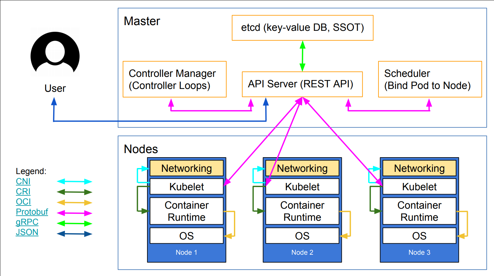
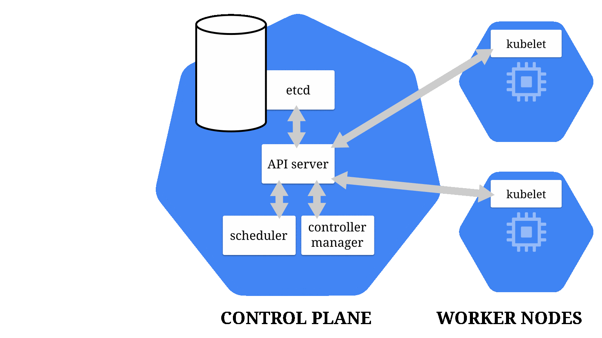

# Hammering together the most basic Kubernetes cluster

Notes from [Deep Dive into Kubernetes Internals for Builders and Operators](https://www.youtube.com/watch?v=3KtEAa7_duA&t=288s)

An step by step presentation for manually setting up a basic kubernetes cluster.

It's specially good because it adds different components one by one when something goes wrong, so you'll get a good idea
why an specific component is needed.

## What do we want to achieve?

Learn how to run the most basic kubernetes cluster from scratch. In other words, how to create the most basic cluster
capable of running the following commands successfully:

```bash
kubectl create deployment web --image=nginx
kubectl scale deployment web --replicas=3
kubectl expose deployment web --port=80
```

## Kubernetes architecture



## What happens when you create a deployment

1. kubectl generates a YAML manifest describing a Deployment
2. The manifest is sent to the Kubernetes API server
3. The Kubernetes API server validates the manifest and persists it to etcd
4. Deployment controller wakes up and creates needed ReplicaSets for the deployment and persists the result on etcd.
5. ReplicaSet controller wakes up and creates needed Pods for the ReplicaSets and stores the results on etcd
   (Pods status: PENDING).
6. Scheduler wakes up and assigns Nodes to each Pod and stores the results on etcd (Pods status: Node x).
7. Kubelet asks the API Server about new work to do and gets back the newly created Pods (Pods status: CREATING).
8. Kubelet informs Container Runtime about new Pods and Container Runtime creates needed containers.
9. Kubelet informs Networking about needed changes in services and Networking applies needed changes.
10. Kubelet informs API Server about newly created Pods and API Server stores the results on etcd (Pod status: RUNNING)



## Let’s build a basic cluster

### What we need

- Linux Machine
  - 86_64 architecture
  - 2 GB RAM
  - 1 CPU
  - Root access (For Docker and Kubelet)
- Binaries:
  - etcd
  - Kubernetes (kubectl, kube-apiserver, kube-controller-manager, kubelet, kube-proxy, …)
  - docker

### The Process

#### Create a deployment

- Create deployment

```bash
kubectl create deployment web --image=nginx
```

```markdown
Fails to connect to API server, because it's not running!
```

- Run kube-apiserver

```bash
kube-apiserver
```

```markdown
Missing list of etcd servers!
````

- Run etcd

```bash
etcd
```

```markdown
Ok
```

- Re-run kube-apiserver

```bash
Kube-apiserver --etcd-servers=http://localhost:2379
```

```markdown
Ok
```

- Re-run deployment creation

```bash
kubectl create deployment web --image=nginx
```

```markdown
Deployment created, but no ReplicaSet or Pod created!
```

This is because the Controller Manager for deployments is not running!

- Run Controller Manager

```bash
kube-controller-manager --master=http://localhost:8080
```

```markdown
ReplicaSet is created, but still no Pod!

In output of kube-controller-manager:
  No **API token** found for **service account** “default”, retry after the token is automatically created and added to
  the service account.
```

Service Account Token is a bearer token automatically added to Pods by API server. It allows in-cluster processes to
talk to the API server.
We need a system to generate and sign ServiceAccountTokens, but for the purpose of this tutorial we’ll simply tell the
API server to not use the service account token.

- Tell API server to ignore service account tokens

```bash
kubectl edit sa default
```

At the end of the Service Account definition add `automountServiceAccountToken: false`

```markdown
Pod is created, but with status “Pending”!
```

Because there is no scheduler to assign the pod to a Node. Also, there is no Node!

- Run kube-scheduler

```bash
kube-scheduler --master=http://localhost:8080
```

```markdown
Ok
```

- Run a kubelet

```bash
kubelet
```

```markdown
Needs a container engine!
```

Kubelet does not run containers itself. Instead, it utilizes other container engines like **docker**, **rkt**,
**containerd**, etc.

- Start docker

```bash
dockerd
```

```markdown
Ok
```

- Re-run kubelet

```bash
kubelet
```

```markdown
It runs, but nothing happens, because it's in standalone mode!
```

We need to create a YAML manifest telling kubelet about the API server it’s suppose to connect to.

- Create the config file for kubelet

```bash
kubectl config set-cluster localhost --server=http://localhost:8080
kubectl config set-context localhost --cluster=localhost
kubectl config use-context localhost
```

```markdown
Successfully created a config file in .kube/config.

It contains a cluster named “localhost”, a context named “localhost” (marked as “default” context) which refers to the
“localhost” cluster.
```

```bash
cat .kube/config
```

```yaml
apiVersion: v1
kind: Config
clusters:
- cluster:
    server: http://localhost:8080
  name: localhost
- context:
    cluster: localhost
    user: ””
  name: localhost
current-context: localhost
users: []
preferences: {}
```

- Re-run kubelet

```bash
Kubelet --kubeconfig ~/.kube/config
```

```markdown
Ok, the pod’s status goes to ContainerCreating and after a while goes to Running.
```

At this stage if we curl its IP address (obtained from kubectl get pods -o wide) we’ll see “welcome to nginx” page.

#### Create a service and setup Pod-to-Service networking

- Create service

```bash
kubectl expose deployment web --port=80
```

```markdown
Service created, but when curl its IP address nothing happens!
```

It’s kube-proxy’s job to setup some iptable rules for each service and connect them to desired Pods.

- Start kube-proxy

```bash
kube-proxy --master=http://localhost:8080
```

```markdown
Ok
```

Now if curl service IP’s again we’ll see “welcome to nginx” page.

#### Add a new Node

- Run kubelet on a new server
  - First copy .kube/config to the new machine and change cluster IP address to masters IP address.
  - Start dockerd

```bash
Kubelet --kubeconfig ~/.kube/config
```

```markdown
Fails to connect to the API server!
```

By default kube-apiserver listens on localhost, we need to change it.

- Tell API server to listen on all interfaces

```bash
kube-apiserver --etc-servers=http://localhost:2379 --address 0.0.0.0
```

```markdown
Ok
```

Restart other components of the control plane (kube-controller-manager, kube-scheduler, etc.) as they exit when
kube-apiserver exits.

After that the node will join the cluster successfully.

- Create a new deployment

```bash
kubectl create deployment httpenv --image=jpetazzo/httpenv
kubectl scale deployment httpenv --replicas=3
kubectl expose deployment httpenv --port=8888
```

```markdown
Everything seems ok, but if we try to send a set of requests, we’ll find out that only one Pod is replying!
```

If we look closer to the output of `kubectl get pods -o wide` we’ll find out that pods on different nodes might have the
same IP addresses!

It's because kubelet does not deal with the network and delegates this job to the container engine. So, when we start a
new node container engine of that node is not aware of the existence of other containers on other nodes and might reuse
an IP address.

To solve this issue we have two options: “kube-net” and “CNI”
> kube-net a simple implementation for networking, each node will have a subnet, kube-net pick an IP address from the
> pool, assign it to the Pod, and put the Pod on a bridge.

- Re-run kubelet with a network-plugin (on both nodes)

```bash
kubelet --kubeconfig .kube/config --network-plugin=kubenet --pod-cidr=10.99.n.0/24
```

```markdown
Pod IPs are still the same!
```

Because kubelet does not touch running Pods, we need to delete them in order for them to be re-created.

- Delete pods

```bash
kubelet delete pods --all
```

```markdown
Pods have different IPs, but we can not ping pods on Node2 from Node1!
We need to set up routing to tell the Node1 that Node2’s Pods subnet is on the Node2.
```

- Add routing to Node1

```bash
ip route add 10.99.2.0/24 via <Node2 IP>
```

```markdown
Ping still fails due to Node2 firewall rules!
```

- Allow all packets on Node2!

```bash
iptables -I FORWARD -j ACCEPT
```

```markdown
Ok
```

##### Using CNI instead of kubenet

Configuring the network using kubenet can be a little hard and non-trivial, so we want to try the second option, CNI.
CNI, or Container Network Interface, makes our life easier because:

- Allows us to decouple network configuration from Kubernetes
  - It can allocate IPs to Pods arbitrarily, instead of from a subnet.
  - It lets you allocate IPs without connecting containers to a bridge
- Is implemented by a set of plugins
  - Binary executable invoked by kubelet
  - Can be combined and chained together if needed
- Responsible for:
  - Allocating IP addresses to containers
  - Configuring the network for containers

We’ll be using kube-router for our CNI, it will:

- Provide pods connectivity
  - Route Pod traffics between nodes (no tunnel, no new protocol)
- Internal service connectivity (replacing kube-proxy)
  - Implemented by IPVS
- can act as Network Policy Controller allowing us to implement firewalls between Pods.

How it works:

- A kube-router daemon runs on every node
- kube-router connects to API server and obtains the node’s podCIDR
- Inject the result into local CNI config file
- kube-router connects to API server and obtains the all nodes IP addresses
- Establish a full mesh BGP peering with other nodes
  - It allows us to interconnect our “Pod Network” with other systems.
- Exchange routes over BGP
- Add routes to the linux kernel

- Run kubelet using CNI

```bash
kubelet --kubeconfig .kube/config --network-plugin=cni
```

```markdown
Complaints about not having a CNI configuration!
```

The CNI configuration will be automatically added by a DemonSet.

- Run kube-router as DaemonSet
  Create a manifest for the DaemonSet:

```bash
kubectl create -f cni.yaml
```

```markdown
Fails because it wants to run a privileged container.
```

- Re-run API server while allowing privileged containers:

```bash
kube-apiserver --etcd-servers=http://localhost:2379 --address 0.0.0.0 --allow-privileged
```

```markdown
Complaints about not having a CNI configuration!
```

Also we have to re-run kube-scheduler and kube-controller-manager

- re-run kube-router as DaemonSet

```bash
kubectl create -f cni.yaml
```

- Re-run kubelet using CNI

```bash
kubelet --kubeconfig .kube/config --network-plugin=cni
```

## What’s missing here?

- Security
  - Role Based Access Control (RBAC)
    - Create TLS certificates for all elements in the control plane:
      - etcd
      - API Server
      - Controller Manager
      - Scheduler
    - Create individual certificates for nodes
    - Create the Service Account Tokens for Pods
      - The Controller Manager will generate these tokens
      - The API Server will validate these tokens
  - Node security
    - NodeRestriction admission controller
      - Allows kubelets to only update their own data
    - Node Authorizer
      - Prevents kubelets from accessing data that they shouldn’t
        - Only authorize access to a configmap if a Pod is using it
        - Etc.
    - Bootstrap tokens
      - Allow an easy, safe, and dynamic way for adding new nodes to the cluster
- Availability
  - Highly Available API Server
